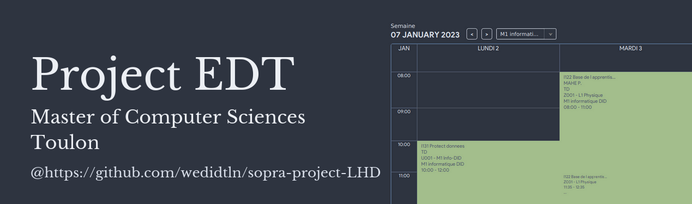
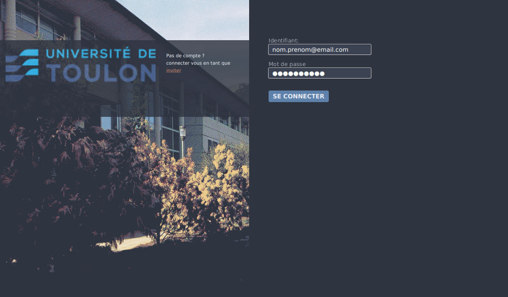
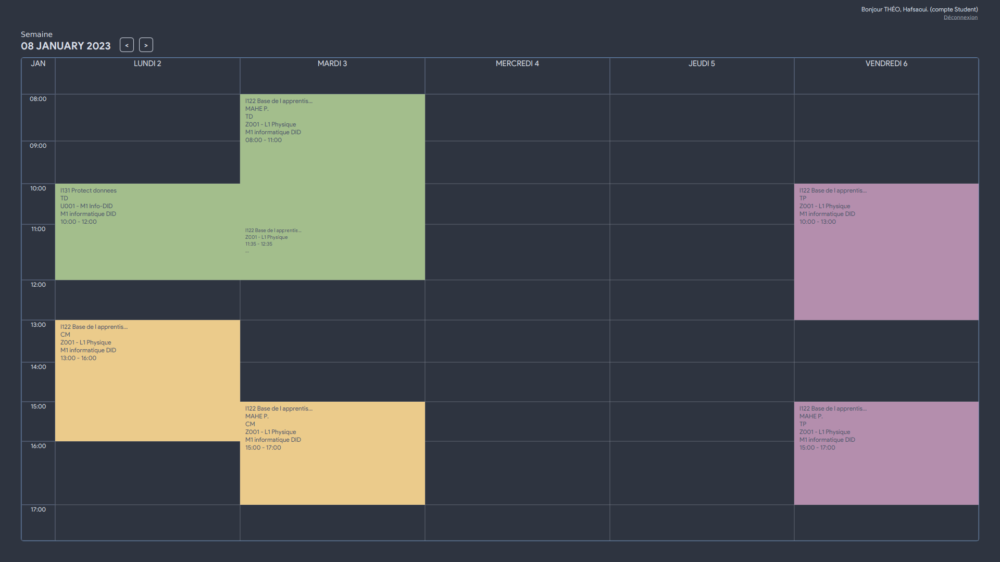
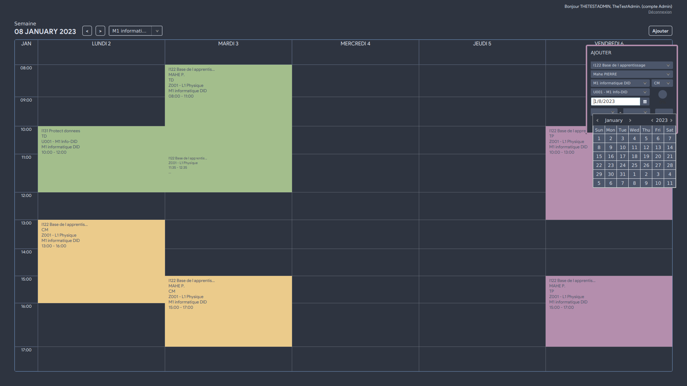

<h1 align="center">
  
  <a href="./.github/file/ConsignesAttendus_du_projetS1-1.pdf">Subject</a>
  |
    <a href="./doc/report.pdf">Report</a>
  |
  <a href="./.github/file/Manuel.pdf">Manual</a>
</h1>

A small project from University, aiming to recreate a java planning app with an enphasis on modern technique
of software engineering.

- Continuous Integration with Github and SonarCloud
- <a href="https://docs.github.com/en/get-started/quickstart/github-flow">Github flow</a> and kanban
- An esthetic UI and exhaustive documentation

Features
--------

- Authentication of a User

  

- See planning of a User


  
  
  
- Manage planning


  

Install
--------------
*Requirement:* PostgreSQL,Java SDK 11+, Maven
  - Create a database `db_name` and initialize it with our script with `psql -d db_name < db_lhd.sql`
  - For now their is no Jar so compile and lauch the app using maven or your IDE

Project layout
--------------
```
.
├── .Github           CI script
├── doc               Javadoc/Manual/Report
├── edtLHD            Java src
├── LICENSE
└── ressources        Database init file
```
